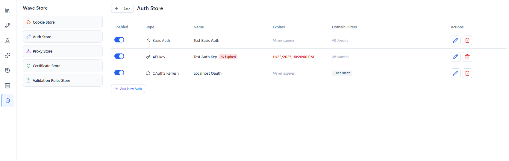

# Authentication

Wave Client can attach authentication to your requests and reuse credentials across many requests. This page covers the supported auth types and where they apply.

---

## Supported auth types

| Type | What it sends | Key options |
| --- | --- | --- |
| **API Key** | A key as a header or query parameter | `key`, `value`, send in **header** or **query**, optional **prefix** (e.g. `Bearer `, `Token `) |
| **Basic** | `Authorization: Basic …` | `username`, `password` |
| **Digest** | HTTP Digest challenge/response | `username`, `password`, plus digest fields (`realm`, `algorithm` such as MD5 / SHA‑256, `qop`, …) |
| **OAuth2 (Refresh Token)** | A bearer access token obtained from a refresh token | `tokenUrl`, `clientId`, `clientSecret`, `refreshToken`, `scope`; the access token is cached and refreshed as needed |

> **Bearer tokens:** there isn't a separate "Bearer" type — use **API Key**, send it in the **header** named `Authorization`, with the prefix `Bearer `.

Each saved credential also carries common options: a unique **name**, an **enabled** flag, **domain filters** (so a credential is only applied to matching hosts), an optional **expiry date**, and a base64‑encode flag.

---

## Where auth applies

- **Per request** — choose an auth type directly on a request.
- **Saved & reused** — store credentials once in the [Wave Store → Auth](wave-store.md) and reference them from multiple requests, with **domain filters** controlling where each one is sent.

### Real‑time protocols
For [WebSocket and SSE](requests.md) connections, auth resolution supports **API key**, **Bearer** (via API Key with a prefix), and **Basic**. Digest is not applied to WS/SSE connections.

---

## Related guides
- [Wave Store](wave-store.md) — save and manage reusable credentials
- [Requests](requests.md) — attach auth to a request
- [Environments](environments.md) / [Variables](variables.md) — keep secrets out of requests using `{{variables}}`
