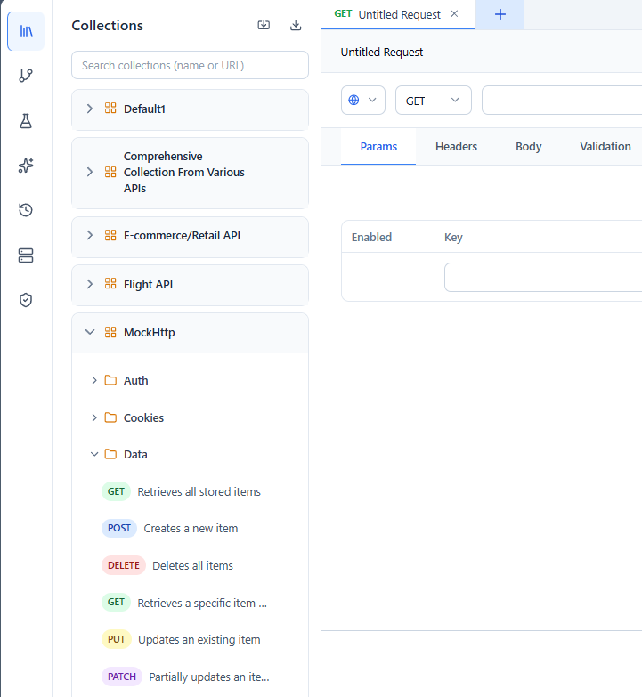
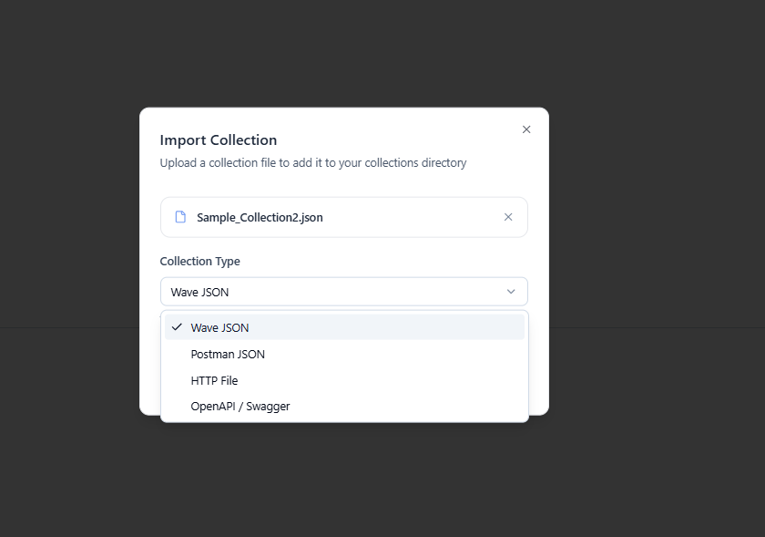
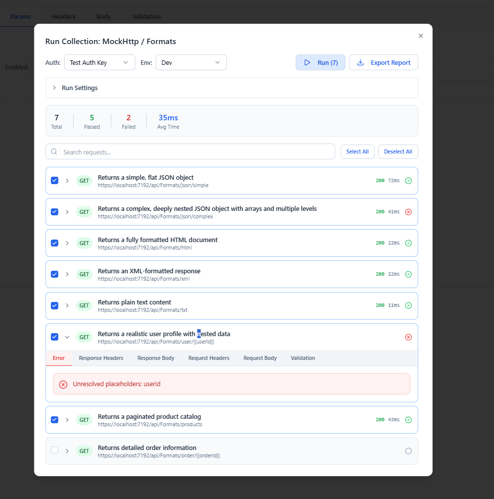

# Collections

A **collection** is a named group of saved requests, organized into nested folders. Collections are how you keep an API project tidy, reuse requests, and run many requests at once.

---

## Structure

A collection contains **folders** and **requests** in a tree:

```text
My API (collection)
├── Auth
│   ├── Login        (request)
│   └── Refresh      (request)
└── Users
    ├── List Users   (request)
    └── Get User     (request)
```

Open the **Collections** tab in the sidebar to browse the tree. Collections can hold HTTP, WebSocket, and SSE requests side by side — see [Requests](requests.md).



---

## Working with items

Each collection, folder, and request row has an action menu with consistent operations:

- **Run** — run the item (a request, or everything under a collection/folder).
- **Rename** — inline rename, with sibling‑level uniqueness checks (press **Enter** to commit, **Escape** to cancel).
- **Delete** — guarded by a confirmation dialog.

Requests additionally support:

- **Move** — relocate a request to another collection or folder. If you name a destination collection that doesn't exist yet, Wave Client creates it as part of the move.
- **Duplicate** — deep‑copy a request with a fresh ID and a collision‑safe name (`Copy`, `Copy 2`, …).

---

## Importing

Wave Client imports several formats and converts them into Wave collections automatically:

- **Postman Collection** (v2.1.0)
- **OpenAPI / Swagger** — OpenAPI 3.x and Swagger 2.0, in **JSON or YAML** (inline `$ref`s are resolved during import)
- **HTTP** files



Native **Wave** collection files import directly. Other formats are transformed on import so requests, grouping, bodies, headers, and query parameters carry over.

---

## Exporting

Export a collection to share it or back it up. Use the export action on a collection to write it to a file.

---

## Running a collection

Run a whole collection (or a folder) to execute its requests in sequence. Results are summarized in a **result explorer**, and you can generate a shareable report — see [Reporting](reporting.md).



---

## Related guides
- [Requests](requests.md) — build the requests you save here
- [Environments](environments.md) — switch base URLs and values per stage
- [Reporting](reporting.md) — export results of a collection run
- [Flows](flows.md) — chain saved requests with data passing between them
