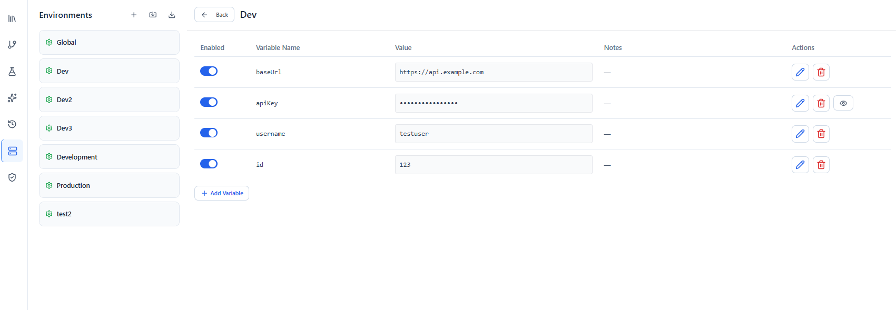

# Environments

An **environment** is a named set of variables — like `Dev`, `Staging`, and `Production` — that let you reuse the same requests against different targets by swapping values instead of editing requests.

You reference environment variables anywhere with `{{variableName}}`. For the full resolution rules and dynamic functions, see [Variables](variables.md).

---

## Environment variables

Each environment holds a list of **key/value** pairs (with optional notes), and each value can be enabled or disabled. Manage them from the **Environments** tab in the sidebar.

Open an environment to edit its variables in a grid:

---

## Global vs. environment scope

Wave Client supports two scopes:

- **Global values** — available regardless of which environment is selected. Good for values that rarely change across stages.
- **Environment‑specific values** — defined inside a particular environment (e.g. a different `baseUrl` for Dev vs. Production).

When a name exists in both, the environment‑specific value takes precedence over the global one.

---

## Selecting an environment

Choose the active environment for a request from the request editor. When a request is sent, `{{variables}}` are resolved using the selected environment plus global values.

---

## Importing & exporting

Environments can be **imported** (including from Postman) and **exported** to a file, so you can share configurations or move them between machines.

---

## Related guides
- [Variables](variables.md) — `{{...}}` resolution and dynamic `_fn_` functions
- [Requests](requests.md) — where variables get used
- [Wave Store](wave-store.md) — store reusable credentials referenced by requests
