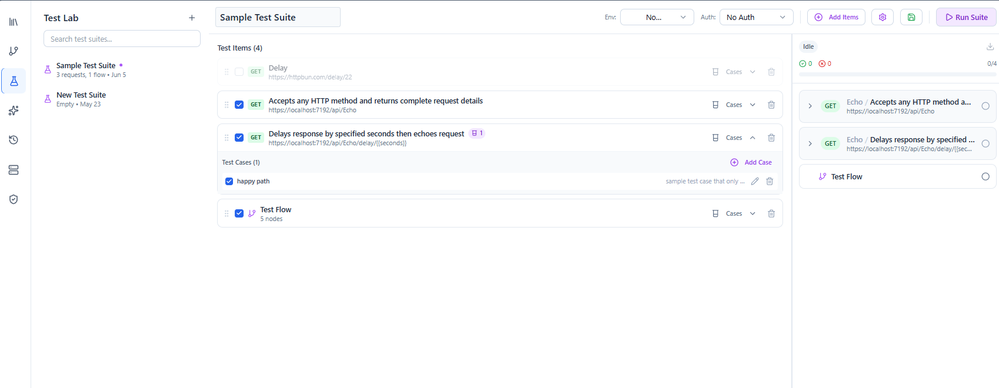
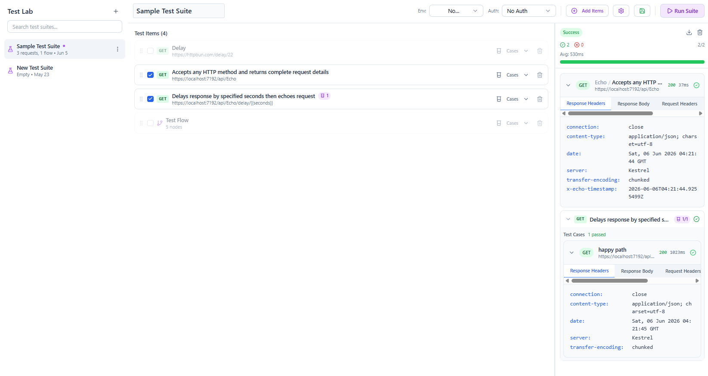

# Test Lab

The **Test Lab** lets you group requests into a **test suite** and run them together with assertions, so you can confirm an API behaves as expected in one click.

Open the **Test Lab** tab in the sidebar.

---

## Test suites

A **suite** is an ordered list of requests, each with its [validations](validations.md) acting as assertions. Add requests to a suite (you can select multiple at once), arrange them, and give the suite a name.

Each request in a suite carries its own validation rules; when the suite runs, those rules determine whether each step passes or fails. See [Validations](validations.md) for the available operators (status, headers, body via JSONPath/JSON Schema).

---

## Running a suite

Run the suite to execute every request in order and evaluate its assertions. The result shows per‑request pass/fail and an overall summary, which you can export — see [Reporting](reporting.md).

---

## Related guides
- [Validations](validations.md) — the assertions used in a suite
- [Requests](requests.md) — build the requests you add
- [Reporting](reporting.md) — export suite results
- [Flows](flows.md) — for data‑passing chains rather than independent checks
