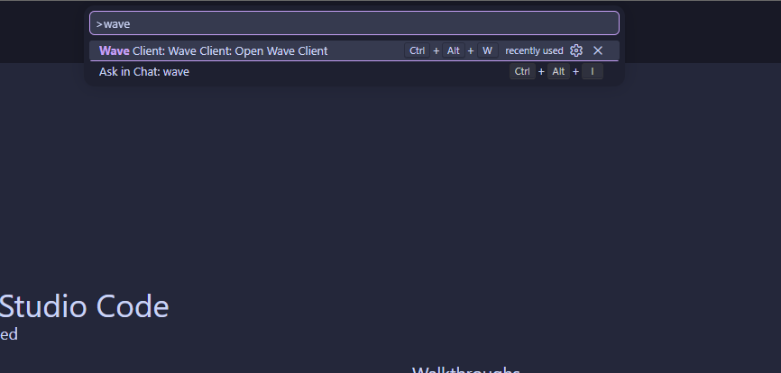
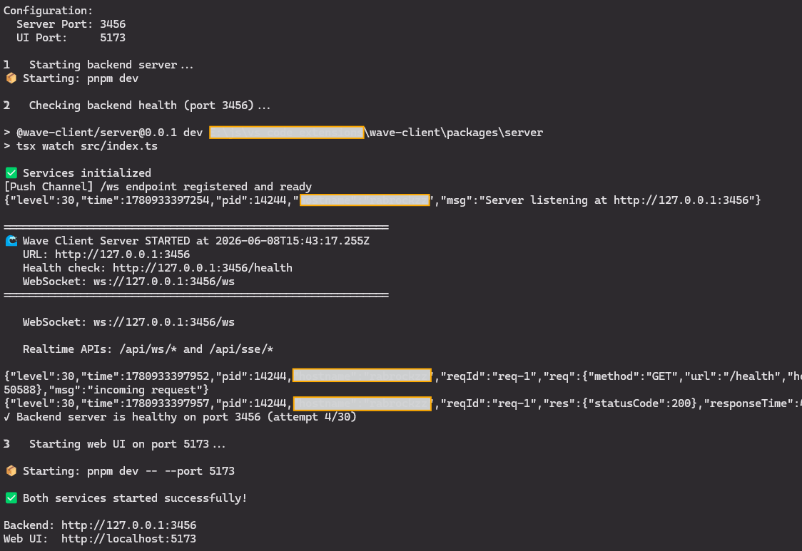

# Installation

Wave Client comes in two flavors. Pick the one that fits how you work — or use both; they share the same features and file formats.

- **[VS Code extension](#vs-code-extension)** — runs inside your editor, right next to your code.
- **[Web app](#web-app)** — runs in your browser, backed by a small local server.

> Looking for platform‑specific details after install? See the [VS Code guide](../platforms/vscode.md) and the [Web app guide](../platforms/web-app.md).

---

## VS Code extension

### Prerequisites
- **Visual Studio Code 1.103** or newer.

### Install
1. Open the **Extensions** view in VS Code (`Ctrl+Shift+X` / `Cmd+Shift+X`).
2. Search for **Wave Client** and click **Install**.

> During the public beta you may also install Wave Client from a packaged `.vsix` file via **Extensions → … → Install from VSIX…** if you received one.

### Open Wave Client
- Open the **Command Palette** (`Ctrl+Shift+P` / `Cmd+Shift+P`) and run **Wave Client: Open Wave Client**, or
- Press the keyboard shortcut **`Ctrl+Alt+W`** (**`Cmd+Alt+W`** on macOS).



Wave Client opens in an editor tab. Your collections, environments, history, and settings are stored by the extension on your machine — see [Settings](../features/settings.md) for where data lives and how to encrypt it.

Continue to the **[Quick Start](quick-start.md)**.

---

## Web app

The web app is a browser UI paired with a lightweight local **server** that performs file access, request execution (proxies, certificates), and encryption — things a browser can't do safely on its own.

### Prerequisites
- **Node.js 18+**
- **pnpm** (the repo's package manager)

### Install & run
From the repository root:

```bash
# 1. Install dependencies for the whole monorepo
pnpm install

# 2. Start the local server + web UI together
pnpm dev:web
```

`pnpm dev:web` starts the backend server and then the web UI once the backend is healthy. By default:

- **Server** runs on port **3456**
- **Web UI** runs on port **5173**

Open **http://localhost:5173** in your browser.



> Need to change ports, or the server won't start? See the [Web app guide](../platforms/web-app.md) for ports, health monitoring, and troubleshooting.

Continue to the **[Quick Start](quick-start.md)**.

---

## Which one should I use?

| | VS Code extension | Web app |
| --- | --- | --- |
| **Best for** | Working alongside your code | Browser‑based workflows / demos |
| **Install** | VS Code Marketplace | Clone repo + `pnpm install` |
| **Backend** | VS Code extension host | Local Wave Client server |
| **Data storage** | Managed by the extension | Server file system |

Both share the same UI, the same request/collection/environment formats, and the same automation features — so you can move between them freely.
