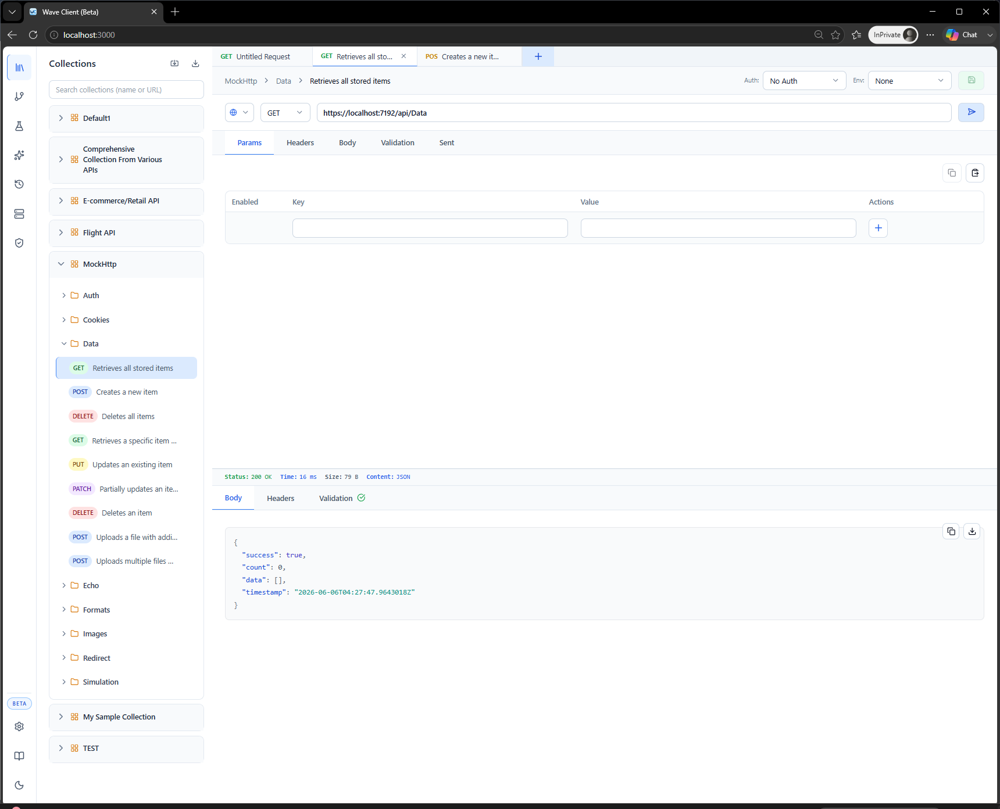

# Web App

The Wave Client web app runs in your browser and is backed by a small **local server**. The server handles the things a browser can't do safely on its own — file access, request execution with proxies/certificates, and encryption — while the browser renders the same UI as the VS Code extension.

For installation, see [Installation → Web app](../getting-started/installation.md#web-app).



---

## Running it

From the repository root:

```bash
pnpm install   # first time only
pnpm dev:web   # starts the server, then the web UI
```

`pnpm dev:web` starts the backend server, waits until it's healthy, then starts the web UI.

### Default ports
- **Server:** `3456`
- **Web UI:** `5173` → open **http://localhost:5173**

You can run just the server with `pnpm dev:server` if you want to manage the UI separately.

---

## Documentation icon

Click the **Documentation** icon at the bottom of the left sidebar (next to Settings and the theme toggle) to open this documentation in a new browser tab.

---

## Server connection status

The web app monitors the connection to the local server. If the server isn't running, a banner appears prompting you to start it. Start (or restart) the server and the app reconnects.

---

## Where your data lives

In the web app, your collections, environments, history, and stores are stored by the **local server** on your machine. See [Settings](../features/settings.md) for storage location and encryption.

---

## Troubleshooting

| Symptom | Fix |
| --- | --- |
| Banner: "Server disconnected" | Start the server: `pnpm dev:server` (or rerun `pnpm dev:web`). |
| Port already in use | Stop whatever is using port `3456`/`5173`, or start the server on a different port. |
| UI loads but requests fail | Confirm the server is healthy and reachable at `http://127.0.0.1:3456`. |

---

## Related
- [Installation](../getting-started/installation.md)
- [Quick Start](../getting-started/quick-start.md)
- [Settings](../features/settings.md)
- [VS Code extension](vscode.md) — the editor‑integrated alternative
